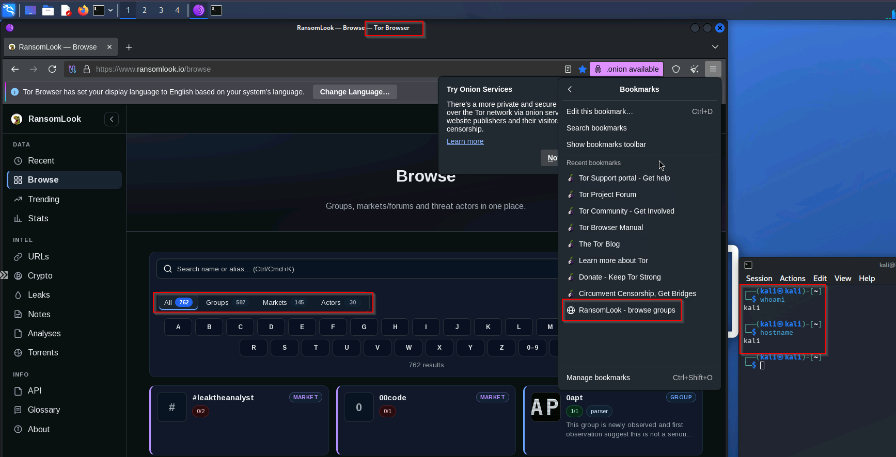

# RansomWhere?

**Keep your personal infrastructure clean!**

Build your own burnable VM to safely visit ransomware data leak sites or potential phishing pages! Even if it gets compromised, the TA has a disposable burner box, and a simple `terraform destroy` later and the TA gets nothing!

## Prerequisites

- Terraform >= 1.9, Azure CLI, an authenticated `az login` session
- Two Azure CLI extensions for Bastion connectivity (first run will prompt, or add ahead of time):

```powershell
az extension add -n bastion
az extension add -n ssh
```

- An SSH keypair. Generate a dedicated one:

```powershell
ssh-keygen -t ed25519 -C "ransomwhere-lab"
```

Put the **public** key contents in `terraform.tfvars` as `ssh_public_key`.

## Configuration

- **Cloud & IaC**: Azure, provisioned with Terraform (azurerm ~> 4.0)
- **VM**: Single Kali 2026.2 VM, `Standard_D2s_v7`, on a private subnet with no public IP
- **Egress**: NAT gateway (the VM has no public IP; outbound only)
- **Access**: Azure Bastion (**Standard** SKU — required for Linux RDP and native-client SSH tunneling)
- **Browsers**: Firefox + Tor Browser, both policy-configured with RansomLook / ransomware.live aggregator bookmarks. The aggregators surface current .onion leak-site addresses — the lab points at them rather than hardcoding onions, which rotate constantly.
- **Auth**: Azure via `az login` (no credentials in code). SSH is key-only; the RDP password is set by hand on first login (`sudo passwd`) so it never lands in Terraform state.

### What this lab deliberately does *not* do

- **No hardcoded .onion addresses**:  they rotate; the aggregator bookmarks are the durable pointer.
- **No VPN layer**: Access indirection comes from Bastion (you never reach the VM directly).  Egress anonymity comes from Tor. On a burner box in your own tenant, the NAT IP touching a Tor guard is an exposure you've accepted by design.

## Validated Config
See the below screenshot from the Bastion RDP session:


## Terraform Setup
*⚠️ VM size availability is subscription- and region-specific.* This lab defaults to `Standard_D2s_v7`. Free-tier and credit-based subscriptions are often restricted from B-series and older D-series (v4/v5/v6) in a given region. The failure looks like `SkuNotAvailable` / `NotAvailableForSubscription` several minutes into `apply`. Find a size your subscription can actually use with:

```powershell
az vm list-skus --location eastus2 --size Standard_D2 --all --output table
```

Look for a size with `None` in the **Restrictions** column (blank/None = available). Set it in `variables.tf > vm_size`, or override per-run with `-var="vm_size=Standard_XXX"`. Pick an `s`-suffixed size — the OS disk is Premium_LRS and non-`s` sizes can't attach premium storage.


*⚠️ At the time of development (July 2026), the most recent Kali VM was `kali-2026-2`. Depending on when you try to `apply`, this may be obsolete.*

To get the currently offered kali images, run the below command and take the value from the SKU column, then enter it in `variables.tf > kali_sku`:

```powershell
az vm image list --publisher kali-linux --offer kali --all --output table
```

To run:
```powershell
terraform init      # download providers, one-time setup
terraform fmt       # format the .tf files
terraform validate  # check syntax and references
terraform apply     # build the lab (type yes to confirm)
```

## Post-Deployment Setup

After `apply` completes, cloud-init is still provisioning inside the VM (installing XFCE, fetching Tor Browser, then a reboot). Wait approx. 5ish minutes for it to finish before connecting.

1. SSH in via Bastion (swap in your key path):

```powershell
az network bastion ssh --name ransomwhere-bastion --resource-group ransomwhere-rg --target-resource-id <VM_RESOURCE_ID> --auth-type ssh-key --username kali --ssh-key <PATH_TO_PRIVATE_KEY>
```

The exact command is printed as the `bastion_ssh_command` output.

2. Confirm provisioning finished, then set the RDP password:

```bash
cloud-init status --wait      # blocks until done
sudo passwd kali
```

3. RDP in (use the `bastion_rdp_command` output), authenticate with the password from step 2. You land on XFCE with both browsers and the bookmarks.

### Destroy the lab
Of course, when done (**or you get burned!!!**), just run:
```powershell
terraform destroy
```

## License 
MIT, because you're doing all the work. 